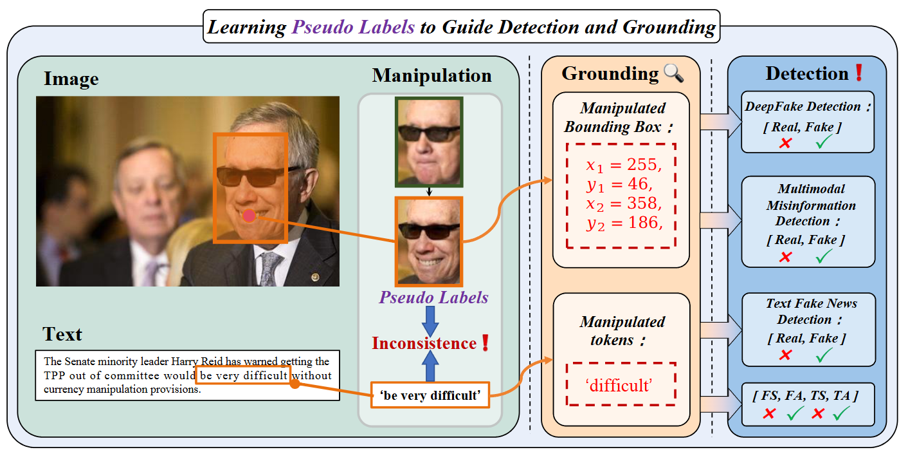
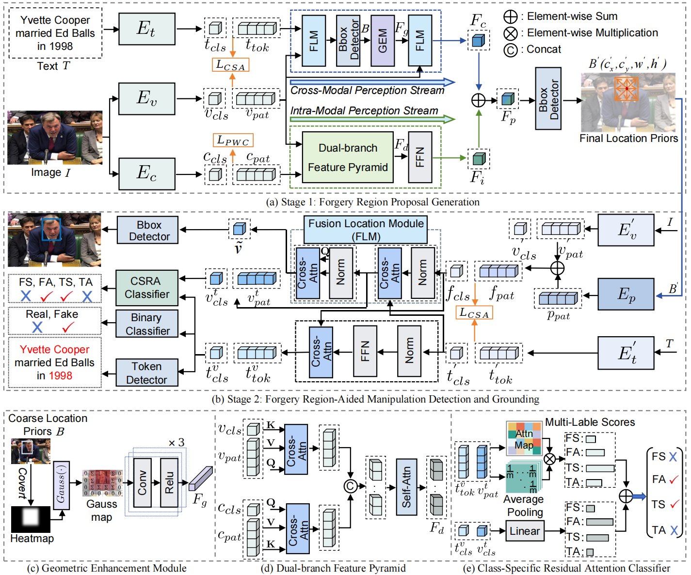

<div align="center">

# Spatial Intelligence as a Prior: A Two-Stage Framework for Multimodal Forgery Detection and Grounding
<br>



</div>

## 📌Introduction
This is the official implementation of *Spatial Intelligence as a Prior: A Two-Stage Framework for Multimodal Forgery Detection and Grounding*. We propose a novel pseudo-label guided paradigm for multimodal manipulation detection, namely **P**seudo **L**abel Guided **M**ultimodal **M**anipulation **D**etection (PMMD).

Different from existing methods that treat detection and localization as loosely coupled tasks, PMMD establishes a unified framework where high-quality manipulation localization pseudo labels act as spatial priors to systematically enhance both visual grounding and cross-modal reasoning.

Our two-stage architecture consists of:
1. Forgery Region Proposal Generation
2. Forgery Region-Aided Manipulation Detection and Grounding

The framework of the proposed PMMD model:

<div align="center">

</div>

This implementation is written by Bingwen Hu and Jun Zhou at Anhui University of Technology.

## 🛠️Prerequisites
- Python 3.8 or above
- Pytorch 1.12
- CUDA 11.6 or above


## 📦Installation

### Clone the Repository
```
mkdir code
cd code
git clone https://github.com/zj-stu/PMMD.git
cd PMMD
```

### Set Up the Environment
We recommend using Anaconda to manage the python environment:
```
conda create -n PMMD python=3.8
conda activate PMMD
conda install --yes -c pytorch pytorch=1.10.0 torchvision==0.11.1 cudatoolkit=11.3
pip install -r requirements.txt
conda install -c conda-forge ruamel_yaml
```

### Prepare data
For dataset preparation, please refer to the detailed instructions in:  
👉 [MultiModal-DeepFake (by rshaojimmy)](https://github.com/rshaojimmy/MultiModal-DeepFake)
👉[SAMM-RamDG-CAP](https://github.com/shen8424/SAMM-RamDG-CAP)


## Testing
1. Download the pre-trained model checkpoint.
2. Modify test.sh to set your desired configuration.
3. Run inference:
```
sh test.sh
```

### Model checkpoint

The best checkpoint of our trained model: [best-model-checkpoint](https://huggingface.co/zj-1/PMMD/tree/main)  

##  Acknowledgement

We sincerely thank the authors of [MultiModal-DeepFake](https://github.com/rshaojimmy/MultiModal-DeepFake) and [SAMM-RamDG-CAP](https://github.com/shen8424/SAMM-RamDG-CAP) for their excellent work.  
